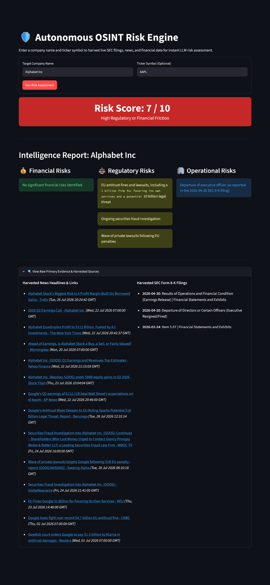
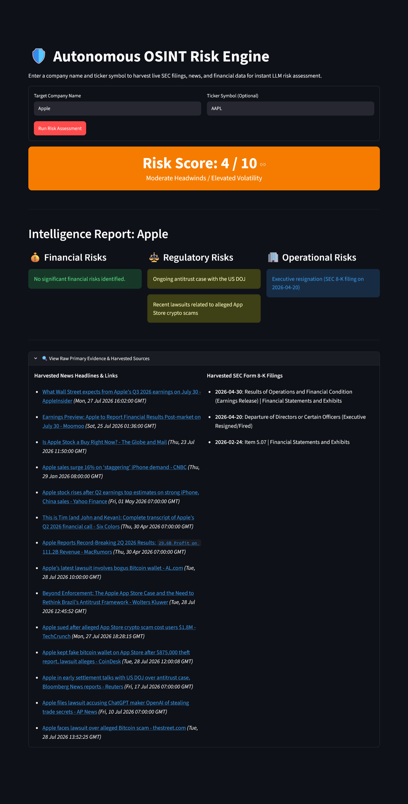
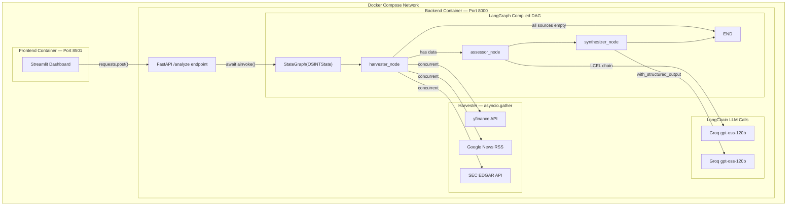

# 🛡️ Autonomous OSINT Risk Engine

> An asynchronous, agentic pipeline built with **LangGraph** and **FastAPI** that autonomously harvests real-time open-source intelligence (OSINT), financial metrics, and SEC filings to generate enterprise-grade corporate risk assessments.


---

## 🚀 Live Demo

| Service | URL | Description |
|---------|-----|-------------|
| 🖥️ **Streamlit Dashboard** | [osint-risk-engine.streamlit.app](https://osint-risk-engine.streamlit.app/) | Interactive UI — run a live corporate risk scan |
| ⚙️ **FastAPI Backend (Render)** | [osint-risk-engine.onrender.com/docs](https://osint-risk-engine.onrender.com/docs) | Swagger UI — explore and call the REST API directly |
| 🐳 **Docker** | See [Quickstart](#quickstart-docker) below | Run the full stack locally in two commands |

> **Note:** The live Render backend spins down after inactivity (free tier). First request may take ~30s to cold-start.

---

## Interface Preview

Here is a look at the Streamlit dashboard rendering live OSINT intelligence into our Friction & Volatility Scale:

### High Regulatory Friction (Score: 7/10)


### Moderate Headwinds (Score: 4/10)


---

## System Architecture

The engine is built on a directed acyclic graph (DAG) using LangGraph, with three primary nodes and a data-availability circuit breaker that skips the LLM entirely if all sources return empty — saving API credits and failing gracefully.



### Node Breakdown

| Node | File | Role |
|------|------|------|
| **Harvester** | `app/nodes/harvester.py` | Concurrently fetches yfinance, Google News RSS, and SEC EDGAR via `asyncio.gather` |
| **Assessor** | `app/nodes/assessor.py` | Applies temporal + materiality rules to extract genuine risks (free-text LLM via LCEL) |
| **Synthesizer** | `app/nodes/synthesizer.py` | Structures output into a rigid Pydantic schema with calibrated 1–10 score (`with_structured_output`) |

---

## Tech Stack

| Layer | Technology | Purpose |
|-------|-----------|---------|
| **Orchestration** | LangGraph `StateGraph` | DAG execution, conditional routing, typed state passing |
| **LLM Interface** | LangChain + Groq (`gpt-oss-120b`) | LCEL prompt chains, structured JSON extraction |
| **Data Validation** | Pydantic v2 `BaseModel` | State schema, API contracts, LLM output schema |
| **REST API** | FastAPI + Uvicorn | Async HTTP server, rate limiting, CORS |
| **Frontend** | Streamlit | Interactive dashboard, HTTP client to backend |
| **Data Sources** | `yfinance`, SEC EDGAR API, Google News RSS | Real-time financial, regulatory, and news data |
| **Infrastructure** | Docker multi-stage build + Compose | Containerization, service networking, env management |
| **Testing** | Pytest + `unittest.mock` | Mocked pipeline tests — no real API calls in CI |

---

## Engineering Highlights

- **⚡ Concurrent Data Ingestion** — All three data sources are fetched simultaneously via `asyncio.gather`, making harvester latency `max(t₁, t₂, t₃)` instead of `t₁ + t₂ + t₃`.
- **🧠 Data-Availability Circuit Breaker** — A conditional LangGraph edge inspects harvested state. If all sources are empty/errored, the graph routes to `END` without invoking the LLM.
- **🔒 Dual LLM Invocation Patterns** — The Assessor uses a free-text LCEL chain; the Synthesizer uses `with_structured_output(RiskReport)` to force valid Pydantic JSON. Two fundamentally different patterns in one pipeline.
- **📏 Calibrated Prompt Engineering** — Financial benchmarks, temporal awareness (dynamic date injection), and materiality scale rules are embedded directly in the system prompt to prevent hallucination and false positives.
- **🐳 Multi-Stage Docker Build** — Builder stage compiles C extensions; only the pre-built `/opt/venv` is copied to the slim runner image, reducing final image size by ~200–400MB.
- **🛡️ Production Hardening** — Rate limiting (5 req/min via `slowapi`), per-environment CORS via `FRONTEND_ORIGIN` env var, and graceful error handling that prevents raw stack traces from leaking to clients.

---

## Quickstart (Docker)

The easiest way to run the full stack is via Docker Compose.

**1. Clone and enter the repo:**
```bash
git clone https://github.com/RishiBarapatre/osint-engine.git
cd osint-engine
```

**2. Set your environment variables:**
```env
# .env (create this file in the project root)
GROQ_API_KEY=your_groq_api_key_here
```

**3. Build and launch both services:**
```bash
docker-compose up --build
```

**4. Access the applications:**

| Service | URL |
|---------|-----|
| 🖥️ Streamlit Dashboard | `http://localhost:8501` |
| ⚙️ FastAPI Swagger UI | `http://localhost:8000/docs` |

---

## Quickstart (Local — No Docker)

**1. Install dependencies:**
```bash
# Using pip
pip install -r requirements.txt

# Or using Conda
conda env create -f environment.yml
conda activate osint_agent
```

**2. Set your environment variables:**
```bash
echo "GROQ_API_KEY=your_groq_api_key_here" > .env
```

**3. Start the FastAPI backend:**
```bash
uvicorn app.main:app --reload --port 8000
```

**4. In a separate terminal, start the Streamlit frontend:**
```bash
streamlit run app/frontend.py
```

The frontend automatically connects to `http://127.0.0.1:8000` by default.

---

## API Reference

### Endpoints

| Endpoint | Method | Rate Limit | Description |
|----------|--------|------------|-------------|
| `/health` | `GET` | None | Liveness check for container orchestrators |
| `/analyze` | `POST` | 5 req/min per IP | Triggers the full OSINT pipeline for a target company |

### Example Request

```bash
curl -X POST "http://localhost:8000/analyze" \
  -H "Content-Type: application/json" \
  -d '{
    "query": "Boeing",
    "ticker_symbol": "BA"
  }'
```

### Example Response

```json
{
  "status": "success",
  "data": {
    "company_name": "Boeing",
    "financial_risks": [
      "Elevated debt-to-equity ratio signals ongoing financial stress from 737 MAX crisis and pandemic-era borrowing."
    ],
    "regulatory_risks": [
      "Active DOJ criminal investigation into 737 MAX safety certifications.",
      "FAA production cap limiting monthly 737 deliveries."
    ],
    "operational_risks": [
      "IAM machinists strike disrupting commercial aircraft production at Renton and Everett facilities."
    ],
    "risk_score": 8,
    "raw_sources": {
      "news": [
        {
          "headline": "Boeing faces new FAA scrutiny over 787 fuselage gaps",
          "link": "https://...",
          "published": "Tue, 23 Sep 2026 10:00:00 GMT"
        }
      ],
      "sec_filings": [
        {
          "date": "2026-09-10",
          "type": "SEC Form 8-K",
          "event_details": "Costs Associated with Exit or Disposal Activities (Layoffs/Restructuring)"
        }
      ]
    }
  }
}
```

> The full OpenAPI schema is auto-generated at `/docs` (Swagger UI) and `/redoc`.

---

## Environment Variables

| Variable | Required | Default | Description |
|----------|----------|---------|-------------|
| `GROQ_API_KEY` | ✅ Yes | — | Your [Groq API key](https://console.groq.com) for LLM inference |
| `BACKEND_API_URL` | No | `http://127.0.0.1:8000/analyze` | Frontend → backend URL. Set automatically by Docker Compose. Override for cloud deployments. |
| `FRONTEND_ORIGIN` | No | `http://localhost:8501` | Allowed CORS origin for the backend. Comma-separate multiple origins (e.g. `https://your-app.streamlit.app,http://localhost:8501`). |

---

## Project Structure

```
osint-engine/
├── app/
│   ├── nodes/
│   │   ├── harvester.py       # Concurrent data ingestion (yfinance, RSS, SEC EDGAR)
│   │   ├── assessor.py        # LLM risk extraction (free-text LCEL chain)
│   │   └── synthesizer.py     # Structured JSON synthesis (with_structured_output)
│   ├── graph.py               # LangGraph DAG + conditional routing logic
│   ├── state.py               # Pydantic OSINTState schema (shared across all nodes)
│   ├── main.py                # FastAPI app: endpoints, rate limiting, CORS
│   └── frontend.py            # Streamlit dashboard (HTTP client to backend)
├── tests/
│   └── test_main.py           # 4 Pytest tests with AsyncMock — no real API calls
├── assets/                    # Dashboard screenshots
├── Dockerfile                 # Multi-stage build (builder → slim runner)
├── docker-compose.yml         # Two-service orchestration (backend + frontend)
├── requirements.txt           # Pip dependencies
└── environment.yml            # Conda environment spec
```

---

## Testing

The test suite mocks the LangGraph execution to avoid real API calls, making it CI/CD safe.

```bash
python -m pytest tests/ -v
```

| Test | What it validates |
|------|------------------|
| `test_health_check` | Liveness endpoint returns `200 OK` |
| `test_analyze_company_success` | Full happy-path with `AsyncMock` — verifies response schema and mock call count |
| `test_analyze_company_missing_query` | Pydantic blocks missing `query` field with `422 Unprocessable Entity` |
| `test_analyze_company_graph_failure` | API catches LangGraph exceptions and returns `500` |

---

## Friction & Volatility Scale

The engine avoids binary "buy/sell" signals. Instead it uses a standard OSINT intelligence friction scale:

| Score | Classification | Example Triggers |
|-------|---------------|-----------------|
| **1–3** | 🟢 Routine Operations / Low Friction | Normal operations, routine litigation, standard executive turnover |
| **4–6** | 🟡 Moderate Headwinds / Elevated Volatility | Major structural regulatory changes, significant revenue decline, concerning debt growth |
| **7–9** | 🔴 High Regulatory or Financial Friction | Active fraud investigations, auditor resignations, severe liquidity crunches, massive combined fines |
| **10** | ⚫ Structural Failure / Imminent Collapse | Bankruptcy proceedings, exchange delisting, complete operational halt |

---

## Contributing

Issues and pull requests are welcome. For significant changes, please open an issue first to discuss what you'd like to change.