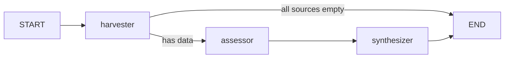
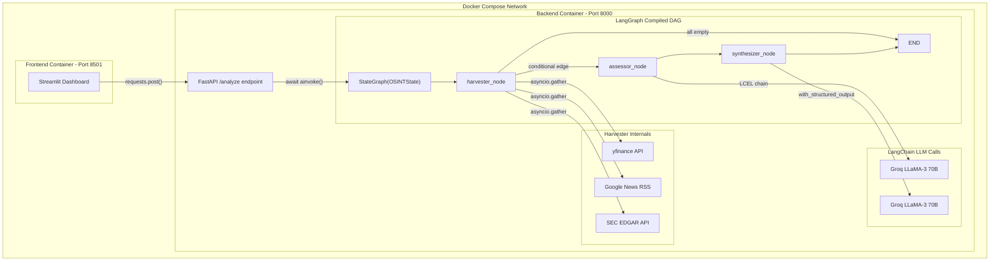

# OSINT Risk Engine — Technical Deep-Dive

A framework-by-framework breakdown of every technical pattern used in this project, how they're wired together, and the specific API surfaces being leveraged.

---

## 1. LangGraph — Orchestration Engine

LangGraph is the core backbone. You're using it as a **stateful DAG runtime** — not as a chatbot or a cyclic agent loop, but as a deterministic multi-step pipeline with one conditional branch.

### 1.1 Specific LangGraph APIs Used

| API | Where | What it does |
|-----|-------|-------------|
| `StateGraph(OSINTState)` | [graph.py:29](file:///d:/Projects/osint-engine/app/graph.py#L29) | Initializes a typed state graph. The generic parameter `OSINTState` (a Pydantic `BaseModel`) tells LangGraph the schema of the data flowing through every node. |
| `workflow.add_node(name, fn)` | [graph.py:32-34](file:///d:/Projects/osint-engine/app/graph.py#L32-L34) | Registers three callable nodes — `"harvester"`, `"assessor"`, `"synthesizer"`. Each function receives the full `OSINTState` and must return it (mutated). |
| `workflow.add_edge(START, "harvester")` | [graph.py:37](file:///d:/Projects/osint-engine/app/graph.py#L37) | The `START` sentinel is a LangGraph constant representing the graph's entry point. This creates a static edge from entrypoint → harvester. |
| `workflow.add_conditional_edges(...)` | [graph.py:40-47](file:///d:/Projects/osint-engine/app/graph.py#L40-L47) | **This is the most interesting LangGraph feature used.** It attaches a routing function (`route_after_harvest`) to the `"harvester"` node's output. The function inspects the state and returns a string key, which is mapped to the next node via a dictionary. |
| `workflow.add_edge("assessor", "synthesizer")` | [graph.py:50](file:///d:/Projects/osint-engine/app/graph.py#L50) | Static linear edge. |
| `workflow.add_edge("synthesizer", END)` | [graph.py:51](file:///d:/Projects/osint-engine/app/graph.py#L51) | `END` sentinel — terminates the graph. |
| `workflow.compile()` | [graph.py:54](file:///d:/Projects/osint-engine/app/graph.py#L54) | Compiles the graph definition into a runnable `CompiledGraph` object (`osint_app`). After this, no more nodes/edges can be added. |
| `osint_app.ainvoke(inputs)` | [graph.py:65](file:///d:/Projects/osint-engine/app/graph.py#L65), [main.py:44](file:///d:/Projects/osint-engine/app/main.py#L44) | **Async invocation.** Passes an input dict that gets validated against the `OSINTState` schema. LangGraph walks the DAG, executing nodes in topological order and passing the state between them. Returns the final state as a dict. |

### 1.2 The Conditional Edge — How It Actually Works

```
route_after_harvest(state) → "continue_to_assessor" | "skip_to_end"
```

The function at [graph.py:12-23](file:///d:/Projects/osint-engine/app/graph.py#L12-L23) checks three booleans:
- `has_financials` — is `financial_data` non-empty and error-free?
- `has_news` — is `news_data` non-empty and not a single error entry?
- `has_sec` — same check for `sec_filings`.

If **all three** are empty/errored → returns `"skip_to_end"` → maps to `END` → graph terminates without calling the LLM (saves API credits).
Otherwise → returns `"continue_to_assessor"` → maps to `"assessor"` node → normal flow continues.

This is a **data-availability circuit breaker** — not a quality gate. It only trips on total data absence, not partial data.

### 1.3 Graph Topology (DAG)



### 1.4 State Management Pattern

LangGraph is configured here with a **Pydantic BaseModel state** ([state.py](file:///d:/Projects/osint-engine/app/state.py)), not a TypedDict. This means:
- State is validated on graph entry (`ainvoke` validates the input dict against `OSINTState`).
- Each node receives the full state object, mutates it in-place, and returns it.
- There are **no reducers** or **channel annotations** (like `Annotated[list, operator.add]`). The state is a simple mutable object passed sequentially — not merged from parallel branches.

> [!NOTE]
> This is using LangGraph's "simple state" mode. The more advanced features — **checkpointing**, **persistence**, **human-in-the-loop**, **subgraphs**, **parallel node execution**, **streaming**, and **message-based channels** — are **not used**.

### 1.5 What's NOT Used from LangGraph

| Feature | Status |
|---------|--------|
| Checkpointing / Memory | ❌ No persistence between runs |
| Human-in-the-loop (`interrupt_before`/`interrupt_after`) | ❌ Fully autonomous |
| Subgraphs | ❌ Single flat graph |
| Parallel node execution (fan-out/fan-in) | ❌ Nodes are sequential (parallelism happens *within* the harvester node via `asyncio.gather`) |
| Streaming (`astream`, `astream_events`) | ❌ Uses `ainvoke` only (waits for full completion) |
| State reducers / channel annotations | ❌ State is mutated in-place |
| Tool calling nodes | ❌ LLM calls are manual, not tool-bound |
| Cycles / loops | ❌ Pure DAG, no re-execution |

---

## 2. LangChain — LLM Abstraction Layer

LangChain is used **minimally** — specifically for its **model wrappers** and **prompt templating**. There are no agents, tools, chains-of-chains, or retrievers.

### 2.1 Specific LangChain APIs Used

| API | Where | Purpose |
|-----|-------|---------|
| `ChatGroq(model, temperature, api_key)` | [assessor.py:22-26](file:///d:/Projects/osint-engine/app/nodes/assessor.py#L22-L26), [synthesizer.py:46-50](file:///d:/Projects/osint-engine/app/nodes/synthesizer.py#L46-L50) | Instantiates a LangChain chat model wrapping the Groq inference API. Uses `llama-3.3-70b-versatile` with `temperature=0` for deterministic output. This comes from `langchain-groq`, a community integration package. |
| `ChatPromptTemplate.from_messages([...])` | [assessor.py:61-69](file:///d:/Projects/osint-engine/app/nodes/assessor.py#L61-L69) | Creates a structured prompt with `("system", ...)` and `("human", ...)` message tuples. The template uses `{variable}` placeholders that are filled at invocation time. |
| `prompt_template \| llm` (LCEL pipe) | [assessor.py:79](file:///d:/Projects/osint-engine/app/nodes/assessor.py#L79) | **LangChain Expression Language (LCEL).** The pipe operator composes the prompt template and LLM into a single runnable chain. When `chain.invoke(...)` is called, the template renders first, then the result is passed to the LLM. |
| `chain.invoke({...})` | [assessor.py:81-87](file:///d:/Projects/osint-engine/app/nodes/assessor.py#L81-L87) | Synchronous invocation of the LCEL chain. Returns an `AIMessage` object; the actual text is accessed via `.content`. |
| `llm.with_structured_output(RiskReport)` | [synthesizer.py:53](file:///d:/Projects/osint-engine/app/nodes/synthesizer.py#L53) | **This is the most powerful LangChain feature used.** It binds a Pydantic model (`RiskReport`) as a JSON schema constraint on the LLM output. Under the hood, LangChain passes the Pydantic schema as a tool/function definition to the model, forcing it to return valid JSON matching the schema. |
| `structured_llm.invoke(prompt)` | [synthesizer.py:66](file:///d:/Projects/osint-engine/app/nodes/synthesizer.py#L66) | Returns a `RiskReport` Pydantic instance directly (not raw text). LangChain handles the JSON parsing and validation automatically. |
| `response.model_dump()` | [synthesizer.py:69](file:///d:/Projects/osint-engine/app/nodes/synthesizer.py#L69) | Converts the Pydantic `RiskReport` back to a plain dict for JSON serialization (stored in `state.final_report`). |

### 2.2 The Two LLM Call Patterns

The project uses two fundamentally different LLM invocation strategies:

**Pattern 1: Free-text extraction (Assessor)**
```
ChatPromptTemplate → ChatGroq → AIMessage (raw text)
```
- Uses LCEL pipe composition
- Returns unstructured bullet-point text
- Output stored as `List[str]` in `state.extracted_risks`

**Pattern 2: Structured JSON extraction (Synthesizer)**
```
ChatGroq.with_structured_output(RiskReport) → RiskReport (Pydantic object)
```
- Uses `with_structured_output()` for schema-constrained generation
- Returns a validated Pydantic object
- Output converted via `.model_dump()` to dict

> [!IMPORTANT]
> The Assessor node uses **synchronous** `chain.invoke()` even though the graph is invoked with `ainvoke()`. This works because LangGraph handles the async/sync bridge internally — it runs synchronous node functions in the default executor. However, this means the LLM calls are **blocking** the event loop thread, which could be a performance concern under high concurrency.

### 2.3 What's NOT Used from LangChain

| Feature | Status |
|---------|--------|
| Agents (AgentExecutor, create_react_agent) | ❌ |
| Tools / Tool bindings | ❌ (data fetching is manual, not via LangChain tools) |
| Retrievers / RAG | ❌ |
| Vector stores | ❌ |
| Output parsers (legacy) | ❌ (uses `with_structured_output` instead) |
| Memory / ConversationBufferMemory | ❌ |
| Callbacks / tracing (LangSmith) | ❌ |
| Document loaders | ❌ |

---

## 3. FastAPI — REST API Layer

### 3.1 Application Setup

[main.py:6-10](file:///d:/Projects/osint-engine/app/main.py#L6-L10) — The `FastAPI` instance is configured with metadata (`title`, `description`, `version`) that auto-populates the Swagger UI at `/docs`.

### 3.2 Endpoints

| Endpoint | Method | Function | Purpose |
|----------|--------|----------|---------|
| `/health` | GET | [health_check()](file:///d:/Projects/osint-engine/app/main.py#L34-L37) | Healthcheck for container orchestrators. Returns static JSON. Synchronous handler (no `async`). |
| `/analyze` | POST | [analyze_company()](file:///d:/Projects/osint-engine/app/main.py#L40-L56) | Core endpoint. Async handler that triggers the LangGraph pipeline via `await osint_app.ainvoke(inputs)`. |

### 3.3 Pydantic Request/Response Models

FastAPI leverages Pydantic v2 models for automatic:
- **Request body validation** — `AnalyzeRequest` at [main.py:13-23](file:///d:/Projects/osint-engine/app/main.py#L13-L23)
  - `query: str` — required (uses `...` as the default, meaning no default = required)
  - `ticker_symbol: Optional[str]` — optional, defaults to `None`
  - Both have `examples` for Swagger UI auto-population
- **Response serialization** — `AnalyzeResponse` at [main.py:26-31](file:///d:/Projects/osint-engine/app/main.py#L26-L31)
  - `response_model=AnalyzeResponse` on the route decorator ensures the response is validated and serialized
- **422 auto-validation** — If `query` is missing, FastAPI/Pydantic automatically returns a 422 with structured error details (tested in [test_main.py:49-60](file:///d:/Projects/osint-engine/tests/test_main.py#L49-L60))

### 3.4 Error Handling

[main.py:55-56](file:///d:/Projects/osint-engine/app/main.py#L55-L56) — A blanket `try/except` wraps the entire graph invocation. Any exception (Groq timeout, data parsing error, etc.) is caught and re-raised as an `HTTPException(status_code=500, detail=str(e))`. This is a simple but effective pattern — it prevents raw stack traces from leaking to the client.

### 3.5 Response Enrichment

[main.py:49-52](file:///d:/Projects/osint-engine/app/main.py#L49-L52) — After getting the graph result, the endpoint manually injects `raw_sources` (news headlines and SEC filings) into the `final_report` dict before returning. This is a **post-processing step outside the graph** — the graph's `final_report` only contains the LLM-synthesized output, but the API response includes the raw evidence for UI transparency/auditability.

### 3.6 Graph Import at Module Level

[main.py:4](file:///d:/Projects/osint-engine/app/main.py#L4) — `from app.graph import osint_app` imports the **compiled graph** at module load time. This means:
- The graph is compiled once when the FastAPI app starts (when Uvicorn imports `app.main`)
- Every request reuses the same compiled graph object
- The graph itself is stateless between requests (state is created fresh for each `ainvoke` call)

---

## 4. Pydantic — Data Modeling

Pydantic is used in **three distinct roles** across the project:

### 4.1 Role 1: LangGraph State Schema

[`OSINTState`](file:///d:/Projects/osint-engine/app/state.py#L5-L43) — A `BaseModel` with 7 fields. Every field uses `Field()` with:
- `default_factory` for mutable defaults (lists, dicts) — avoids the classic Python mutable default gotcha
- `description` strings — these serve as documentation but also as metadata LangGraph could use

The state acts as a typed data contract between all three graph nodes. Each node knows exactly what fields exist, their types, and their semantics.

### 4.2 Role 2: FastAPI Request/Response Validation

`AnalyzeRequest` and `AnalyzeResponse` at [main.py:13-31](file:///d:/Projects/osint-engine/app/main.py#L13-L31). FastAPI auto-generates:
- OpenAPI schema from these models
- Request body validation (422 errors)
- Response serialization

### 4.3 Role 3: LLM Structured Output Schema

[`RiskReport`](file:///d:/Projects/osint-engine/app/nodes/synthesizer.py#L19-L33) — A Pydantic model used exclusively with `with_structured_output()`. The `Field(description=...)` annotations are critical here — LangChain passes these descriptions to the LLM as part of the JSON schema/tool definition, guiding the model on what each field should contain.

The `risk_score` field's description at [synthesizer.py:24-33](file:///d:/Projects/osint-engine/app/nodes/synthesizer.py#L24-L33) is essentially a **calibration rubric embedded in the schema** — it tells the LLM the exact scoring methodology directly in the Pydantic field metadata.

---

## 5. Async Architecture

### 5.1 The `asyncio.gather` Pattern in the Harvester

[harvester.py:186-222](file:///d:/Projects/osint-engine/app/nodes/harvester.py#L186-L222) — The harvester node is the **only truly async node**. It uses:

```python
tasks = [
    asyncio.to_thread(fetch_financials_sync, ...),  # Runs in thread pool
    asyncio.to_thread(fetch_news_sync, ...),         # Runs in thread pool
    asyncio.to_thread(fetch_sec_filings_sync, ...),  # Runs in thread pool
]
results = await asyncio.gather(*tasks, return_exceptions=True)
```

Key details:
- `asyncio.to_thread()` — offloads **synchronous blocking functions** (yfinance, urllib, feedparser) to the default `ThreadPoolExecutor`. This is necessary because these libraries use blocking I/O.
- `asyncio.gather()` — runs all three thread tasks **concurrently**, not sequentially. The wall-clock time for the harvester = `max(time_financials, time_news, time_sec)` instead of the sum.
- `return_exceptions=True` — if one task fails, the others still complete. Exceptions are returned in the results array as `Exception` objects instead of being raised. This is checked at [harvester.py:212-219](file:///d:/Projects/osint-engine/app/nodes/harvester.py#L212-L219) with `isinstance(results[i], Exception)`.
- When no ticker is provided, `asyncio.sleep(0)` is used as a no-op placeholder to keep the results array aligned.

### 5.2 Sync vs Async Nodes

| Node | Signature | LLM Call | Why |
|------|-----------|----------|-----|
| `harvester_node` | `async def` | N/A | Needs `await asyncio.gather()` for concurrent I/O |
| `assessor_node` | `def` (sync) | `chain.invoke()` (sync) | No async operations; LangGraph runs it in executor |
| `synthesizer_node` | `def` (sync) | `structured_llm.invoke()` (sync) | Same as assessor |

---

## 6. Docker — Multi-Stage Build + Compose

### 6.1 Dockerfile — Multi-Stage Build

[Dockerfile](file:///d:/Projects/osint-engine/Dockerfile) uses a **two-stage build**:

**Stage 1: `builder`** (lines 4-17)
- Base: `python:3.11-slim`
- Installs `gcc` and `build-essential` — needed to compile C extensions (some pip packages like `yfinance` or `pydantic` have C components)
- Creates a virtualenv at `/opt/venv` and installs all dependencies into it
- This stage is **discarded** after the build — the gcc toolchain doesn't ship to production

**Stage 2: `runner`** (lines 22-33)
- Base: `python:3.11-slim` (no build tools)
- Copies **only** `/opt/venv` from the builder stage — this contains all installed Python packages
- Copies `./app` application code
- **No CMD defined** — intentionally left blank so `docker-compose.yml` can define different commands per service

> [!TIP]
> The multi-stage pattern reduces the final image size by ~200-400MB because gcc/build-essential and all their dependencies are stripped out. Only the compiled `.so` files survive inside the venv.

### 6.2 Docker Compose — Two-Service Architecture

[docker-compose.yml](file:///d:/Projects/osint-engine/docker-compose.yml) defines two services from the **same Dockerfile**:

| Service | Container | Port | Command | Role |
|---------|-----------|------|---------|------|
| `backend` | `osint_backend` | 8000:8000 | `uvicorn app.main:app --host 0.0.0.0 --port 8000` | FastAPI + LangGraph pipeline |
| `frontend` | `osint_frontend` | 8501:8501 | `streamlit run app/frontend.py --server.port=8501 --server.address=0.0.0.0` | Streamlit dashboard |

Key networking details:
- `depends_on: - backend` — ensures the backend container starts before the frontend
- `BACKEND_API_URL=http://backend:8000/analyze` — Docker Compose creates a default bridge network where services can resolve each other **by service name**. The frontend uses `backend` as the hostname (not `localhost`).
- The `.env` file (containing `GROQ_API_KEY`) is injected via `env_file: - .env` only into the backend service — the frontend doesn't need it.

### 6.3 Why Both Services Use the Same Image

Both `backend` and `frontend` share `build: .` (same Dockerfile). This means:
- One Docker image contains both FastAPI and Streamlit dependencies
- The differentiation is purely in the `command:` override
- Trade-off: simpler setup but a slightly larger image than strictly necessary (includes Streamlit deps in the backend image and vice versa)

---

## 7. Streamlit Frontend

[frontend.py](file:///d:/Projects/osint-engine/app/frontend.py) is a **standalone HTTP client** — it doesn't import any graph or LangChain code. It communicates with the backend purely via `requests.post()`.

### 7.1 Key Technical Patterns

- **Service discovery**: `os.environ.get("BACKEND_API_URL", "http://127.0.0.1:8000/analyze")` at [line 51](file:///d:/Projects/osint-engine/app/frontend.py#L51) — defaults to localhost for local dev, overridden by Docker Compose env var for containerized deployment.
- **Custom CSS injection**: `st.markdown("""<style>...</style>""", unsafe_allow_html=True)` at [lines 14-27](file:///d:/Projects/osint-engine/app/frontend.py#L14-L27) for the colored risk badges.
- **Form-based submission**: `st.form()` groups inputs and prevents re-execution on every widget interaction (Streamlit's default behavior).
- **3-column risk layout**: `st.columns(3)` at [line 85](file:///d:/Projects/osint-engine/app/frontend.py#L85) for Financial / Regulatory / Operational risk display.
- **Raw evidence accordion**: `st.expander()` at [line 116](file:///d:/Projects/osint-engine/app/frontend.py#L116) for auditability — shows the raw harvested data the LLM used.

---

## 8. Data Harvesting Layer (No Framework — Pure Python)

The three data-fetching functions in [harvester.py](file:///d:/Projects/osint-engine/app/nodes/harvester.py) are **plain Python** — no LangChain tools, no LangGraph integrations.

### 8.1 `fetch_financials_sync` — yfinance

[Lines 13-41](file:///d:/Projects/osint-engine/app/nodes/harvester.py#L13-L41)
- `yf.Ticker(ticker).info` — fetches a cached dict of ~150+ financial metrics
- Extracts 7 specific ratios (D/E, current ratio, quick ratio, margins, P/E, P/B)
- `None` values (common for non-standard asset types) are converted to `"N/A (Not reported for this asset type)"` — a smart choice because the LLM will read this string and understand it's not a data error

### 8.2 `fetch_news_sync` — Google News RSS + feedparser

[Lines 45-78](file:///d:/Projects/osint-engine/app/nodes/harvester.py#L45-L78)
- Constructs two targeted RSS search queries (financial performance + legal/regulatory)
- Uses `feedparser.parse()` to parse the XML RSS feed
- **Deduplication**: Uses a `seen_headlines` set to remove duplicate articles across queries
- **HTML entity unescaping**: `html.unescape()` cleans `&amp;`, `&#39;`, etc. from RSS titles

### 8.3 `fetch_sec_filings_sync` — SEC EDGAR API

[Lines 80-181](file:///d:/Projects/osint-engine/app/nodes/harvester.py#L80-L181)
- **Two-step process**:
  1. Maps ticker → CIK (Central Index Key) via `company_tickers.json`
  2. Fetches submissions via `CIK{padded_cik}.json`
- **8-K filtering**: Only extracts Form 8-K (material events), limited to 3 most recent
- **Item code decoding**: A hardcoded `ITEM_MAPPING` dict at [lines 88-109](file:///d:/Projects/osint-engine/app/nodes/harvester.py#L88-L109) translates SEC item codes (e.g., `"4.02"`) into plain English (e.g., `"Non-Reliance on Previously Issued Financial Statements (Accounting Error/Fraud)"`)
- **User-Agent header**: SEC requires a descriptive User-Agent for their API (without it, requests get 403'd)

---

## 9. Testing — Pytest + Mocking

[test_main.py](file:///d:/Projects/osint-engine/tests/test_main.py) has 4 tests, all using FastAPI's `TestClient` (which wraps `httpx` under the hood for synchronous test execution of async endpoints).

### 9.1 Test Strategy

| Test | What it validates |
|------|-------------------|
| `test_health_check` | Basic liveness — no mocking needed |
| `test_analyze_company_success` | Full happy path — **mocks `osint_app.ainvoke`** with `AsyncMock` to avoid real API calls |
| `test_analyze_company_missing_query` | Pydantic validation — expects 422 with specific error structure |
| `test_analyze_company_graph_failure` | Error handling — mocks `ainvoke` to raise an exception, expects 500 |

### 9.2 Mock Pattern

```python
@patch("app.main.osint_app.ainvoke", new_callable=AsyncMock)
def test_analyze_company_success(mock_ainvoke):
    mock_ainvoke.return_value = { ... }  # Fake graph output
```

The mock targets `app.main.osint_app.ainvoke` — patching at the **import location**, not the definition location. This is the correct `unittest.mock` pattern. `AsyncMock` is used because `ainvoke` is an async method, and `TestClient` needs to handle the coroutine resolution.

---

## 10. Project Architecture Summary



### Dependency Flow Summary

| Layer | Technology | Responsibility |
|-------|-----------|----------------|
| **Orchestration** | LangGraph `StateGraph` | DAG execution, conditional routing, state passing |
| **LLM Interface** | LangChain `ChatGroq`, LCEL, `with_structured_output` | Prompt templating, model invocation, structured JSON extraction |
| **Data Validation** | Pydantic `BaseModel` | State schema, API contracts, LLM output schema |
| **API** | FastAPI + Uvicorn | HTTP interface, request validation, async request handling |
| **Frontend** | Streamlit | Dashboard UI, HTTP client to backend |
| **Data Ingestion** | yfinance, feedparser, urllib | Raw data fetching (no framework abstraction) |
| **Infrastructure** | Docker multi-stage build + Compose | Containerization, service networking, env management |
| **Testing** | Pytest + unittest.mock | Mock-based testing of API layer without real LLM calls |
